# DD2424: Deep Learning in Data Science

## **Assignment 1:** Training a Multi-Linear Classifier

---

### **Submission Details**

| **Item**   | **Information**  |
| ---------- | ---------------- |
| **Date**   | April 3, 2026    |
| **Course** | **DD2424**       |
| **Task**   | **Assignment 1** |

### **Student Information**

| **Field**       | **Details**                           |
| --------------- | ------------------------------------- |
| **Name**        | **Jinye Gong**                        |
| **Email**       | `jinyeg@kth.se`                       |
| **Affiliation** | **KTH Royal Institute of Technology** |

### **AI usage statement**

AI was used to assist with report formatting and code debugging. Implementation, experiments, and results are my own.

---

## 1. Objective

The main goal of this assignment is to implement and train, from scratch, a one-layer linear classifier for image classification on CIFAR-10. The model uses a softmax output layer with cross-entropy loss, and an additional L2 regularization term in the objective to control model complexity. Besides implementing both forward and backward propagation, this report analyzes how the learning rate and regularization strength affect training behavior and final test accuracy.

The computation pipeline is:
- logits: `s = W x + b`
- probabilities: `p = softmax(s)`
- objective: cross-entropy loss + L2 regularization weighted by `λ`

---

## 2. Data and Preprocessing

Following the assignment specification:
- training: `data_batch_1` (10000 images)
- validation: `data_batch_2` (10000 images)
- test: `test_batch` (10000 images)

Each image is `32x32x3`, so the input dimension is 3072, and the number of classes is 10.

Before training, the following preprocessing is applied:
1. Scale pixel values to `[0, 1]`.
2. Compute per-dimension mean and standard deviation **only on training data**.
3. Normalize training/validation/test using the same training-set statistics.

It is important not to normalize validation/test with their own statistics, since that would introduce data leakage.

---

## 3. Implementation

The full training pipeline for a linear classifier is implemented, including data loading, normalization, forward pass, loss/cost computation, accuracy, backward pass, and mini-batch gradient descent.

Implemented functions:
- `load_batch`
- `normalize_data`
- `apply_network`
- `compute_loss`
- `compute_cost`
- `compute_accuracy`
- `backward_pass`
- `mini_batch_gd`

In addition, PyTorch autograd (`torch_gradient_computations.py`) is used to verify analytical gradients, including the L2 term in the cost.

---

## 4. Gradient Check

To verify the backward implementation, gradient checking is done on a small problem. Let `g_a` be analytical gradients and `g_n` be PyTorch reference gradients. The maximum relative error is computed as:

```
max( |g_a - g_n| / max(eps, |g_a| + |g_n|) )
```

Results:
- max relative error for `W`: **4.583e-15**
- max relative error for `b`: **1.190e-16**

These errors are extremely small, indicating that the analytical gradients are correct.

---

## 5. Training Setup

Mini-batch gradient descent is used with:
- `n_epochs = 40`
- `n_batch = 100`

Four required configurations are evaluated:
- `λ = 0`, `η = 0.1`
- `λ = 0`, `η = 0.001`
- `λ = 0.1`, `η = 0.001`
- `λ = 1`, `η = 0.001`

---

## 6. Results

### 6.1 Final Test Accuracy

| Configuration | Final Test Accuracy |
|------|--------------------:|
| `λ = 0`, `η = 0.1` | **28.29%** |
| `λ = 0`, `η = 0.001` | **39.11%** |
| `λ = 0.1`, `η = 0.001` | **38.93%** |
| `λ = 1`, `η = 0.001` | **37.53%** |

Overall, both learning rate and regularization strength have visible impact. The `η = 0.1` setup clearly underperforms compared to `η = 0.001`.

### 6.2 Training / Validation Loss and Cost Curves

#### (a) `λ = 0`, `η = 0.1`

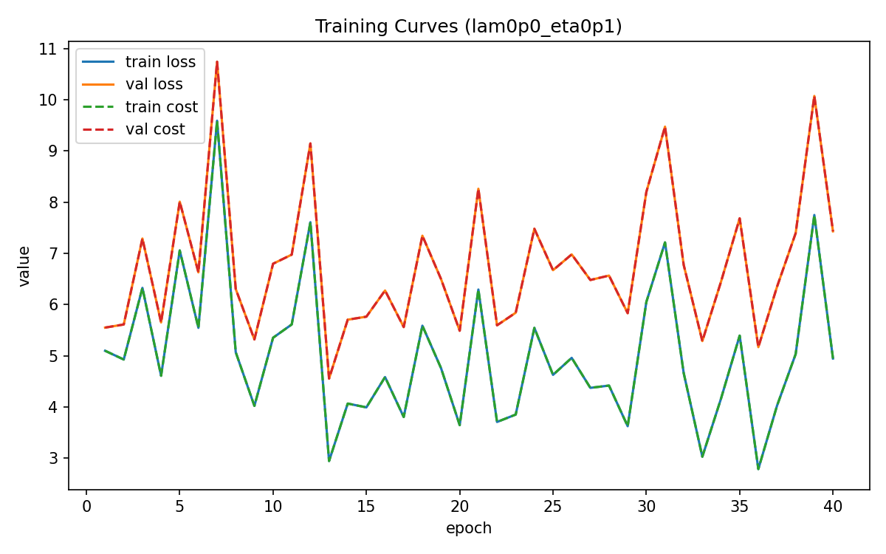

#### (b) `λ = 0`, `η = 0.001`

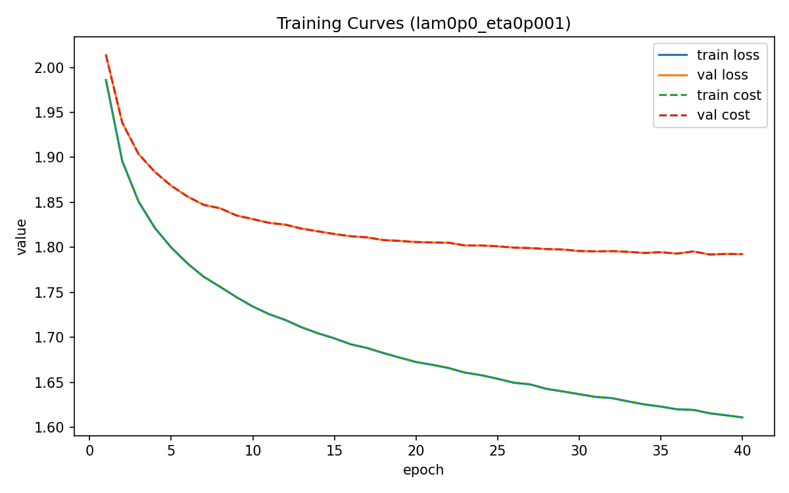

#### (c) `λ = 0.1`, `η = 0.001`

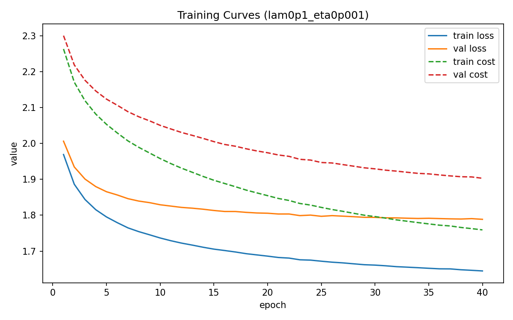

#### (d) `λ = 1`, `η = 0.001`

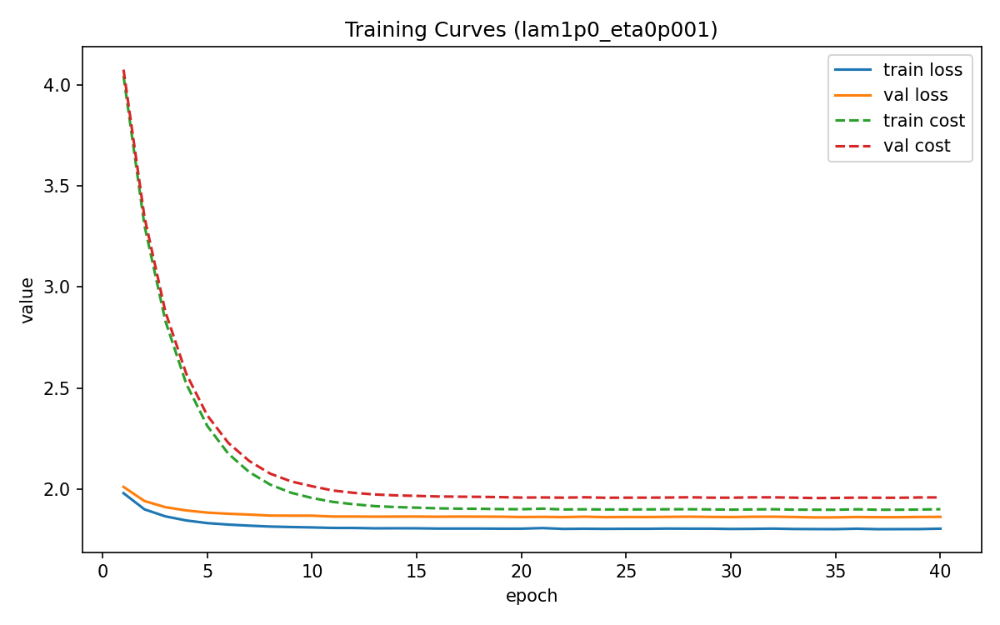

### 6.3 Learned Weight Visualization (Class Templates)

#### (a) `λ = 0`, `η = 0.1`

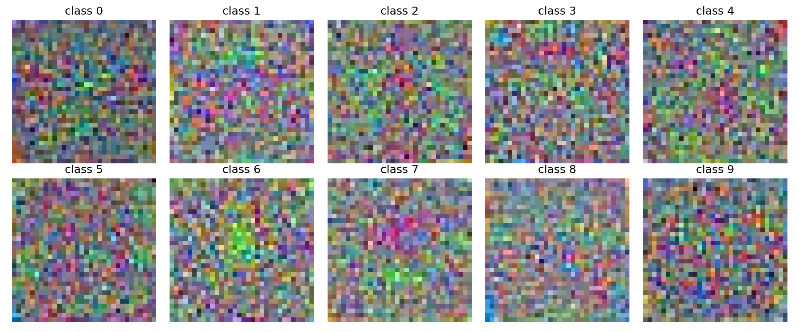

#### (b) `λ = 0`, `η = 0.001`

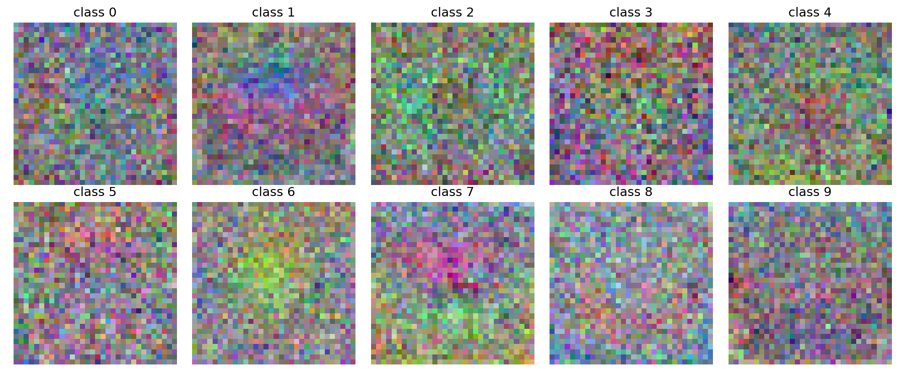

#### (c) `λ = 0.1`, `η = 0.001`

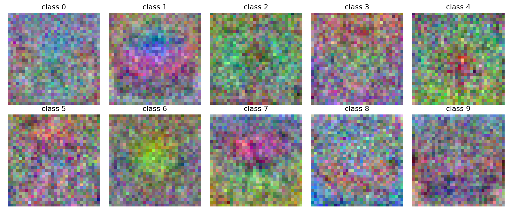

#### (d) `λ = 1`, `η = 0.001`

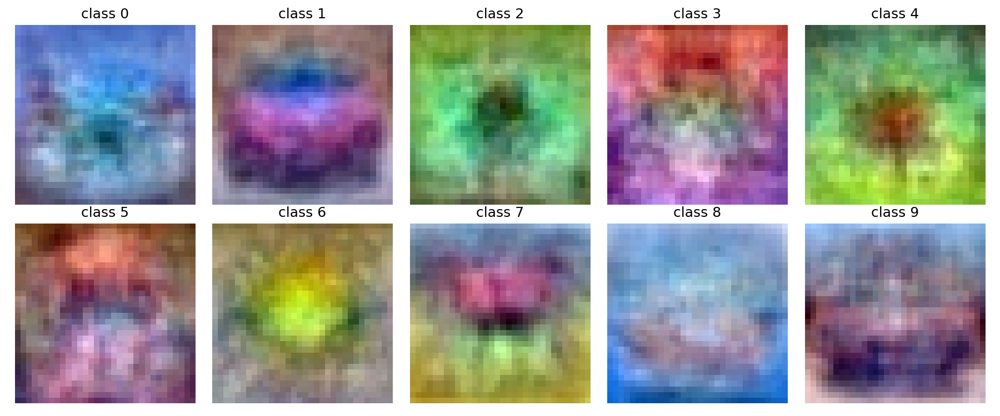

---

## 7. Analysis

From the curves and table, several patterns are clear.

For the learning rate, `η = 0.1` causes strong cost oscillations and unstable optimization, resulting in low test accuracy. This is consistent with overly large update steps. With `η = 0.001`, both training and validation curves are much smoother, and this setup achieves the best test result in the required runs (39.11%).

For regularization, with fixed `η = 0.001`, increasing `λ` from 0 to 0.1 to 1 gradually reduces test accuracy. Since this is a shallow linear model with limited capacity, too strong L2 tends to cause underfitting.

The train/validation gap is moderate rather than extreme, which also matches expectations for a simple linear classifier.

---

## 8. Conclusion

This work successfully implements a one-layer softmax classifier including forward pass, objective computation, backward pass, and mini-batch training. Gradient checking against PyTorch confirms correctness of the implementation.

Under the current setup and data split, the best required configuration is **`λ = 0`, `η = 0.001`**, reaching **39.11%** test accuracy. The experiments indicate that choosing an appropriate learning rate is more critical for stable convergence, while overly strong L2 regularization reduces performance for this model.

---

## 9. Bonus 2.1: Performance Improvements

### 9.1 Methods (3 improvements)

Implemented in `assignment1_bonus.py`:

1. **More training data**: merge `data_batch_1` to `data_batch_5`, then split into **49000** train and **1000** validation samples; keep `test_batch` as test set. Mean/std are estimated only on the training subset.
2. **Horizontal flip augmentation**: apply flipping with probability **0.5** for each sample in each training mini-batch.
3. **Step learning-rate decay**: start with **`η = 0.001`**, multiply by **0.1** every **15** epochs (so after epoch 30, `η = 1e-5`). Use **`λ = 0.01`** with augmentation.

Other settings are unchanged: `n_batch = 100`, `n_epochs = 40`, `numpy.random.default_rng(42)` for reproducibility.

### 9.2 Quantitative Results

| Item | Value |
|------|------|
| Training samples | 49000 |
| Validation samples | 1000 |
| `λ` (L2) | 0.01 |
| Initial `η` | 0.001 |
| Train cost at epoch 40 | **1.7274** |
| Validation cost at epoch 40 | **1.7317** |
| Validation accuracy at epoch 40 | **42.50%** |
| Peak validation accuracy (around epoch 15) | **43.10%** |
| **Final test accuracy** | **41.25%** |

Compared to the main-task best result (**39.11%**, trained only on `data_batch_1`), Bonus 2.1 gives about **+2.1 percentage points** on test accuracy.

### 9.3 Required Figures

**Training/validation loss and cost (computed after each epoch)**:

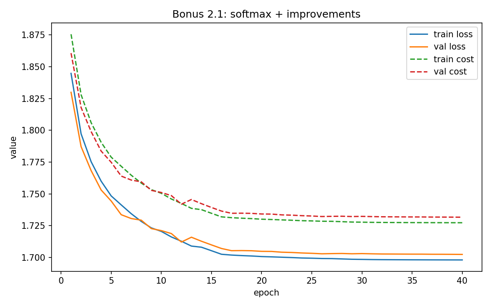

**Learned weight templates (W visualization)**:

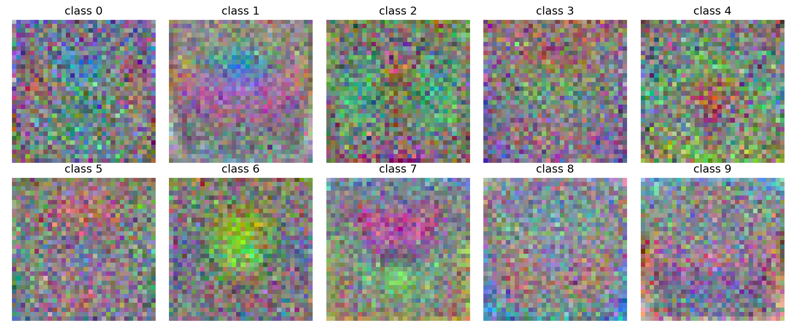

Reproduction command:
`conda run -n dd2424 python assignment1_bonus.py`

---

## 10. Bonus 2.2: Sigmoid + Multiple Binary Cross-Entropy

### 10.1 Setup and Gradient

Replace **softmax + multiclass cross-entropy** with **element-wise sigmoid + averaged K binary cross-entropy terms** (assignment Eq. 14). Class prediction is still based on `argmax`.

The per-sample gradient with respect to logits is:

```
dL / ds = (1/K) * (p - y)
```

Compared to softmax cross-entropy, this adds a `1/K` scaling factor. Therefore, the sigmoid branch uses `η = 0.01`, while the softmax baseline uses `η = 0.001`. Other settings: `n_batch = 100`, `n_epochs = 40`, `λ = 0`, and the same split as Exercise 1 (`data_batch_1` / `data_batch_2` / `test_batch`).

Analytical-vs-PyTorch check (`ComputeGradsSigmoidMultiBCE`) on a small subset:
- max relative error for `W`: **1.082e-14**
- max relative error for `b`: **1.041e-16**

### 10.2 Test Accuracy Comparison

| Method | Test Accuracy |
|------|-------------|
| Softmax + cross-entropy (`η = 0.001`) | **39.13%** |
| Sigmoid + multi-BCE (`η = 0.01`) | **38.27%** |

In this run, softmax is about **0.86 percentage points** higher than sigmoid multi-BCE.

### 10.3 Required Figures

**Train/validation loss comparison** (note that loss scales differ by definition):

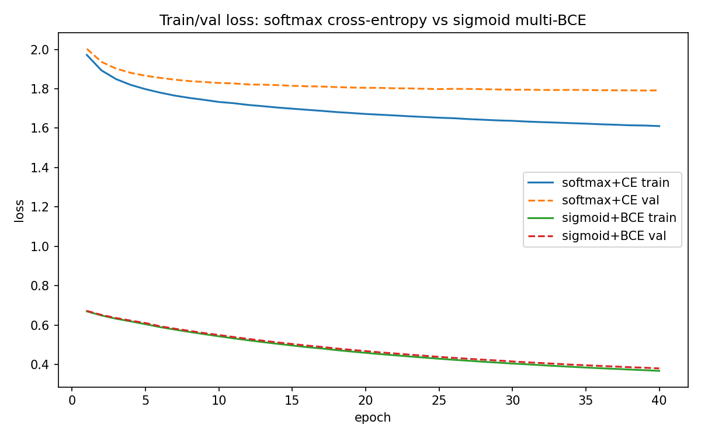

**Histogram of predicted probability for the true class on test data**:

Softmax + cross-entropy:

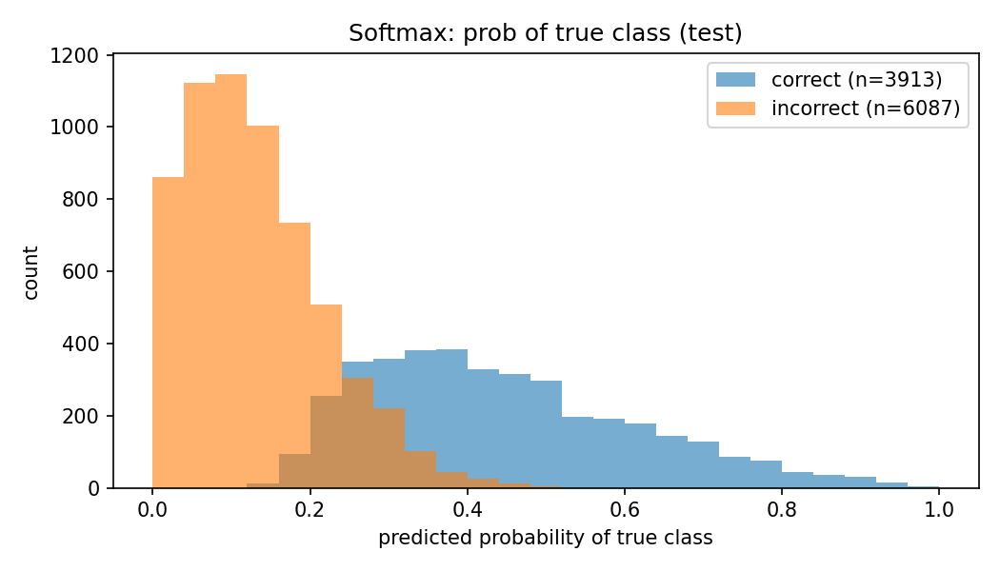

Sigmoid + multi-BCE:

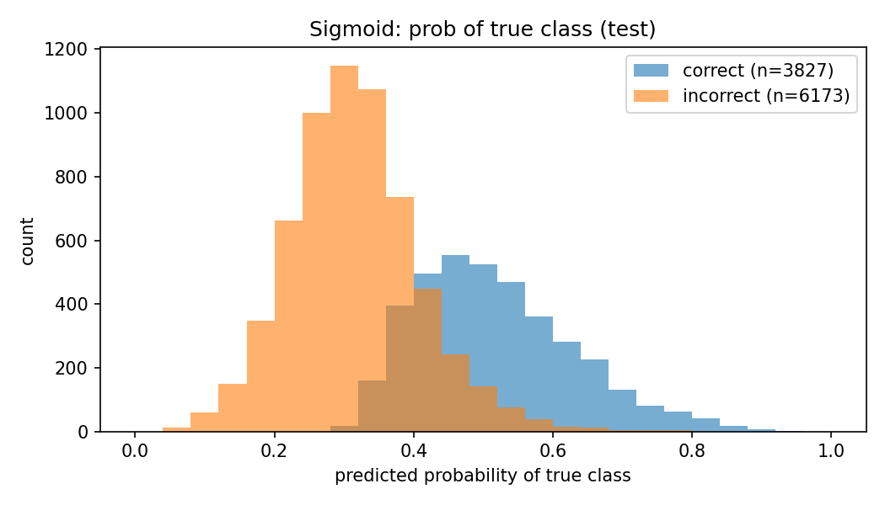

### 10.4 Brief Discussion

- **Overfitting**: For the softmax baseline at around epoch 40, train cost is about **1.61** and validation cost about **1.79**, indicating a moderate gap. For sigmoid, train/validation costs are around **0.367 / 0.380** at epoch 40 (not directly comparable in scale to softmax), and the two curves remain close. Neither setup shows extreme train–validation divergence for this shallow model.
- **Histograms**: For both methods, correctly classified samples tend to have higher predicted probability for the true class, while misclassified samples concentrate more at lower probabilities. Sigmoid does not enforce probability summation to 1, so histogram shapes differ slightly from softmax, but the qualitative behavior is similar.
