# DD2424: Deep Learning in Data Science

## **Assignment 2:** Training a Two-Layer Network (CIFAR-10)

---

### **Submission Details**

| **Item**   | **Information**  |
| ---------- | ---------------- |
| **Date** | April 16, 2026 |
| **Course** | **DD2424** |
| **Task** | **Assignment 2** |

### **Student Information**

| **Field**       | **Details**                           |
| --------------- | ------------------------------------- |
| **Name**        | Jinye Gong                        |
| **Email**       | `jinyeg@kth.se`                       |
| **Affiliation** | **KTH Royal Institute of Technology** |

### **AI usage statement**

AI was used to assist with report formatting and code debugging. Implementation, experiments, and results are my own.

---

## 1. Objective

The main goal of this assignment is to implement and train, from scratch, a **two-layer fully connected neural network** with a **ReLU hidden layer** and a **softmax output layer** for **CIFAR-10** image classification. The model is trained using **mini-batch gradient descent** on an objective consisting of **cross-entropy loss** plus an **L2 regularization term**. In addition, the assignment focuses on correctly implementing:

- the forward pass and backward pass gradients, and
- **cyclical learning rates** for faster training without extensive learning rate tuning,
- **hyper-parameter search for the L2 coefficient `λ`** (coarse-to-fine random search).

---

## 2. Data and Preprocessing

Following the assignment specification:

- Exercise 3/4 data split:
  - training: `data_batch_1`
  - validation: `data_batch_2`
  - test: `test_batch`
- For `λ` search:
  - training + validation candidates: `data_batch_1..5`

Preprocessing:

- Scale pixel values to `[0, 1]`.
- Compute per-feature mean and standard deviation **only on the training subset**.
- Normalize training/validation/test with the same `mean_X` and `std_X`.

---

## 3. Implementation

The two-layer network is:

- `s1 = W1 x + b1`
- `h = ReLU(s1)`
- `scores = W2 h + b2`
- `p = softmax(scores)`

Objective:

- Cross-entropy loss over the mini-batch
- Plus L2 regularization on both weight matrices: `λ (||W1||^2 + ||W2||^2)`

Implemented (in `assignment2/Assignment2.py`):

- forward pass: `apply_network`
- backward pass: `backward_pass`
- cyclical learning rate schedule: `cyclic_eta`
- cyclic SGD training: `train_cyclical_sgd`
- gradient check wrapper: `gradient_check_two_layer`

---

## 4. Gradient Check (i)

To verify the backward implementation, gradient checking is performed on a small setup using:

- analytical gradients from `backward_pass(...)`
- PyTorch autograd gradients from `torch_gradient_computations.py`

Results (max relative error):

- `W1`: **6.489e-16**
- `W2`: **1.643e-16**
- `b1`: **6.404e-16**
- `b2`: **1.209e-16**

These values are extremely small, indicating the analytic gradients (including the L2 term) are correct.

---

## 5. Default Cyclical Learning Rates (ii)

Default hyper-parameters (as required by the assignment):

- `eta_min = 1e-5`
- `eta_max = 1e-1`
- `n_batch (batch_size) = 100`
- `λ = 0.01`

### 5.1 Exercise 3 (1 cycle, `ns=500`)

Test accuracy:

- **45.92%**

Required curve figures:

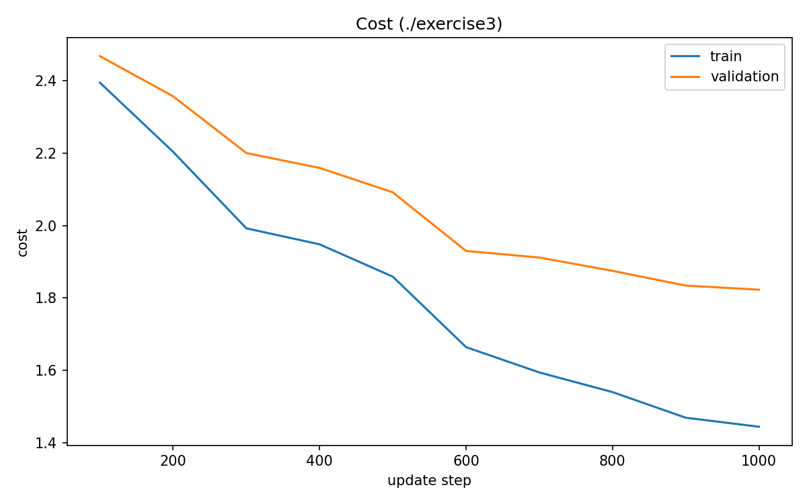
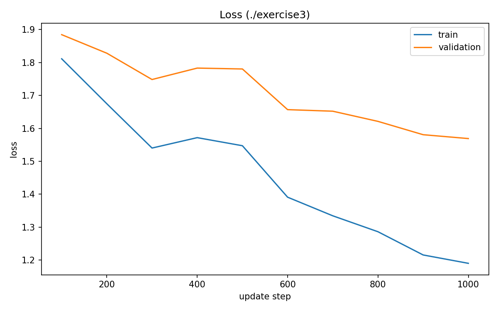
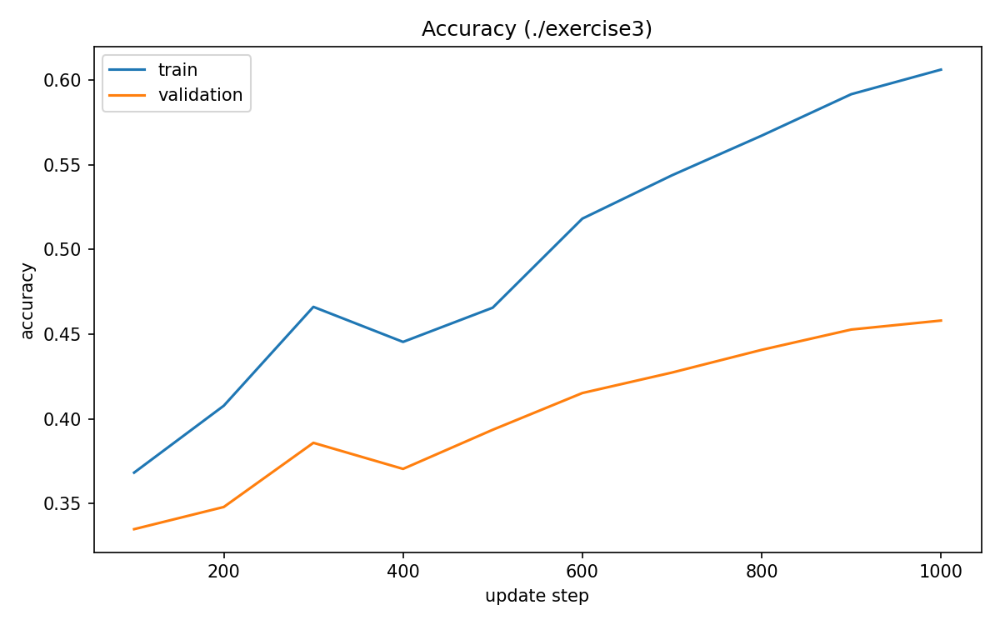

Comment (brief):

- The cost/loss values vary periodically as the learning rate increases/decreases across the cycle.
- Accuracy improves overall but may fluctuate more during the “high learning rate” part of the cycle.

### 5.2 Exercise 4 (3 cycles, `ns=800`)

Test accuracy:

- **47.60%**

Required curve figures:

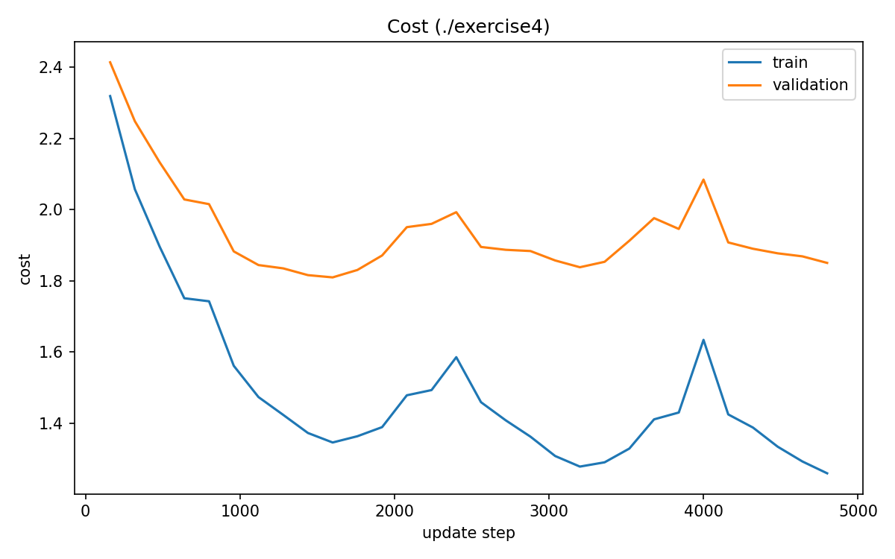
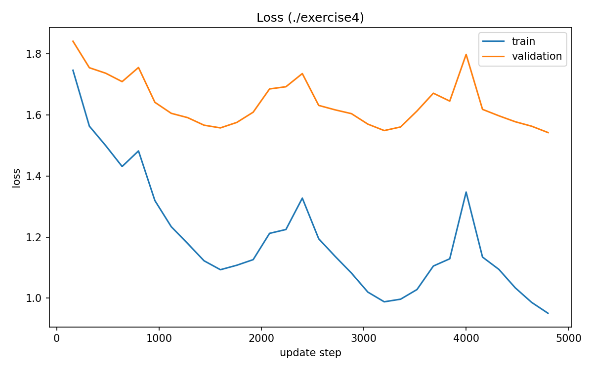
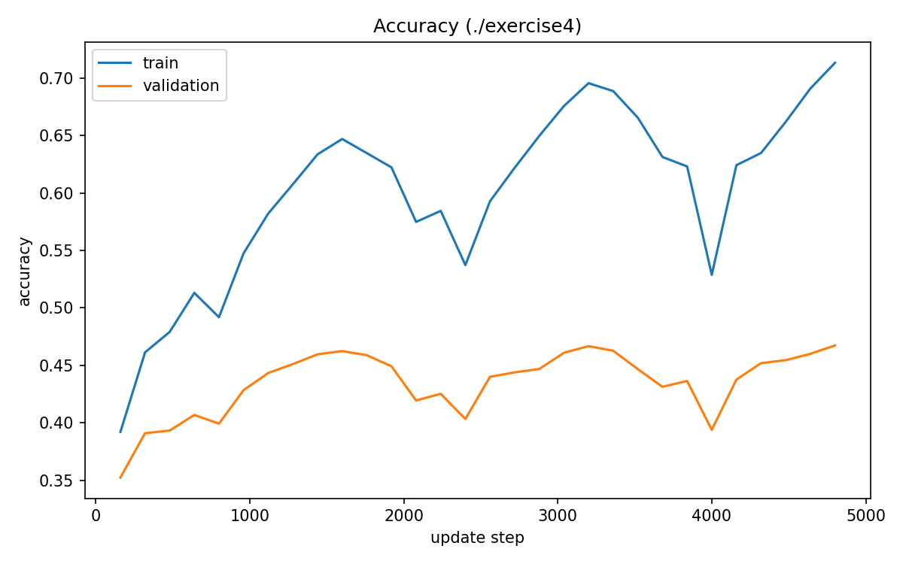

Comment (brief):

- Over multiple cycles, the training process continues to refine the decision boundaries, leading to a higher test accuracy compared to Exercise 3.

---

## 6. `λ` Search (iii, iv)

The code supports coarse-to-fine `λ` search via `--task lambda_search` and writes:

- `lambda_search_coarse.json`
- `lambda_search_fine.json`

### 6.1 Coarse Search (iii)

- Coarse search range:
  - `log10(λ) in [l_min, l_max] = [-5, -1]`
  - i.e. `λ in [1e-05, 1e-01]` (searched on a log grid with 8 values)
- Training/validation split:
  - validation set size for search: `val_size = 5000` (from `data_batch_1..5`)
  - therefore training size used in search: `n_train = 45000`
- Cyclical learning rate & SGD settings:
  - `eta_min = 1e-05`, `eta_max = 1e-01`
  - `batch_size = 100`
  - `coarse_cycles = 2`
  - `ns = 2 * floor(45000 / 100) = 900`

Top-3 configurations (by **best validation accuracy**):

1. `λ = 0.0005179474679231213`, `best_val_acc = 0.5190`, `ns = 900`
2. `λ = 0.00013894954943731373`, `best_val_acc = 0.5124`, `ns = 900`
3. `λ = 0.0019306977288832496`, `best_val_acc = 0.5114`, `ns = 900`

### 6.2 Fine Search (iv)

- Fine search range centered at the best coarse `λ = 0.0005179474679231213`:
  - `lam_fine_radius = 1.0` so `log10(λ) in [l_best-1, l_best+1]`
  - which corresponds to `λ in [5.179e-05, 5.179e-03]`
- Training/validation split:
  - validation set size for search: `val_size = 5000` (same as coarse)
  - therefore training size used in search: `n_train = 45000`
- Cyclical learning rate & SGD settings:
  - `eta_min = 1e-05`, `eta_max = 1e-01`
  - `batch_size = 100`
  - `fine_cycles = 3`
  - `ns = 900`

Top-3 configurations (by **best validation accuracy**):

1. `λ = 0.0014773514956228037`, `best_val_acc = 0.5294`, `ns = 900`
2. `λ = 0.00012460092859159695`, `best_val_acc = 0.5280`, `ns = 900`
3. `λ = 0.0005641945071476144`, `best_val_acc = 0.5280`, `ns = 900`

---

## 7. Best `λ` Final Training + Test Performance (v)

After obtaining the best `λ` from validation:

- Train on `data_batch_1..5`
- Use a validation split of `val_size = 1000`
- Train for about `~3 cycles` (code default uses `cycles_final=3`)
- Plot:
  - `final_best_lam_cost.png`
  - `final_best_lam_loss.png`
  - `final_best_lam_accuracy.png`

Test accuracy to report:

- `best_lam = 0.00147735`, `test_acc = 51.87%` (from script output: `[final] best_lam=0.00147735, test_acc=51.87%`)

Required final figures:

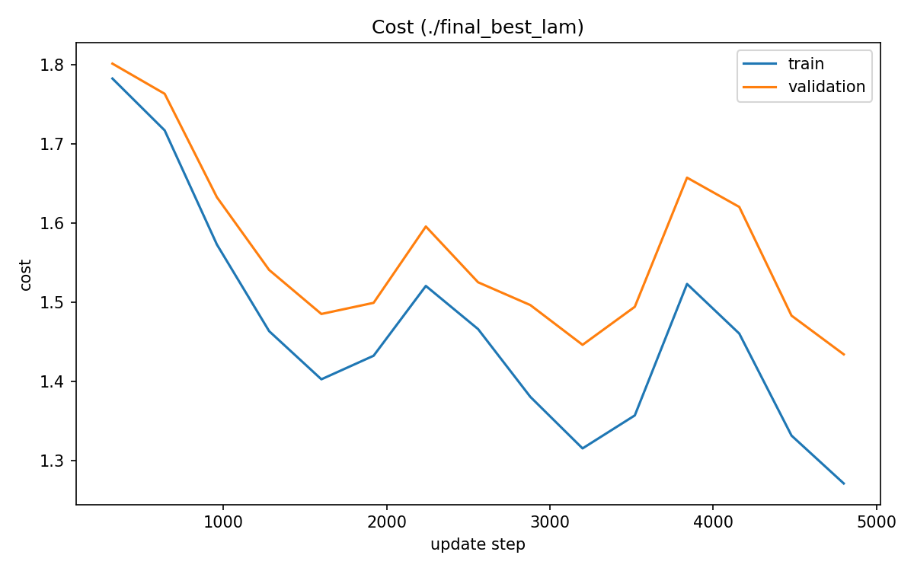
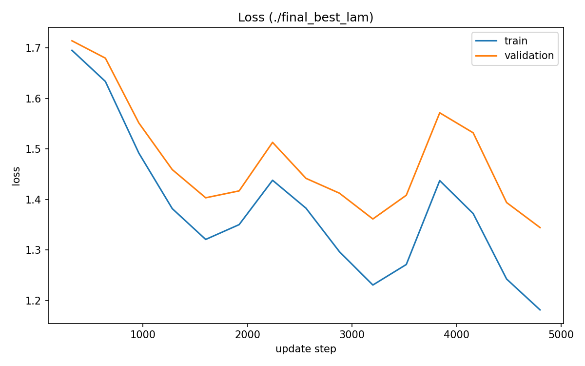
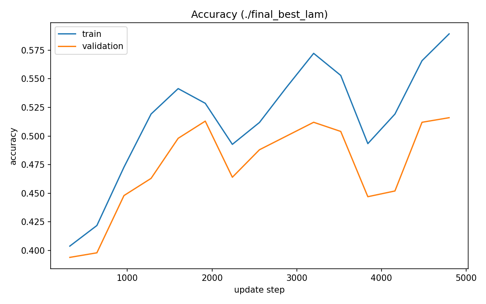

---

## 8. Bonus: Performance Improvements (Exercise 5)

For bonus points, I applied multiple improvements on top of the default 2-layer network:

1. **More hidden nodes**: increase hidden layer size to `m = 200` (instead of the default `m = 50`).
2. **Dropout**: apply dropout on the ReLU hidden activations with `dropout_p = 0.5`.
3. **Data augmentation**: random horizontal flip with probability `flip_p = 0.5` (CIFAR-10 column layout aware).
4. **Optimizer**: use **Adam** instead of cyclical SGD.

### 8.1 Bonus training setup

- Training/validation split: use `val_size = 1000` from the combined candidates `data_batch_1..5`
- Regularization: `λ = 0.01`
- Optimizer learning rate: `lr = 1e-3` (Adam)
- Batch size: `batch_size = 128`
- Epochs: `epochs = 3` (quick run for debugging/verification)
- Hidden size: `m = 200`
- Dropout: `dropout_p = 0.5`
- Data augmentation: horizontal flip `flip_p = 0.5`

### 8.2 Quantitative results

- Best validation accuracy: **43.71%**
- Final test accuracy: **42.35%**

### 8.3 Required bonus figures

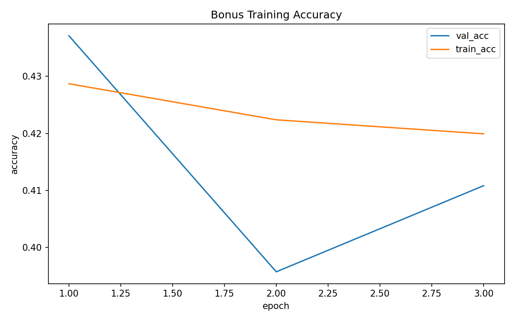
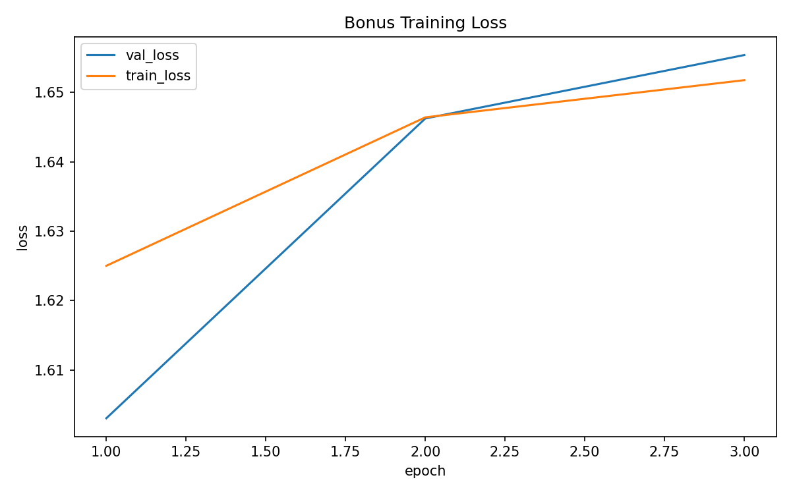

