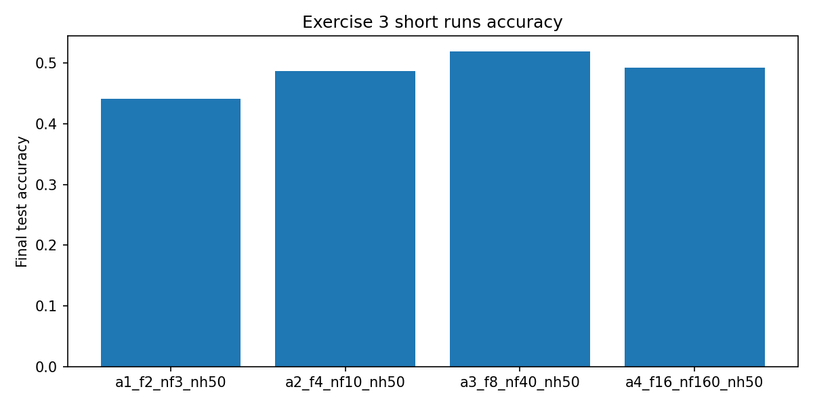
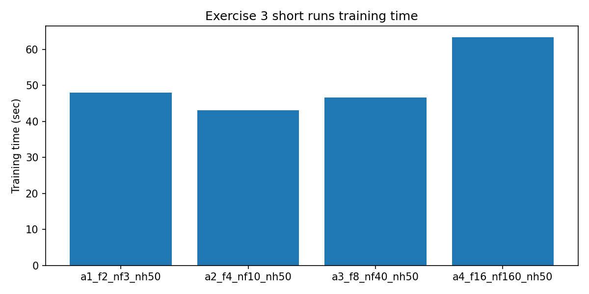
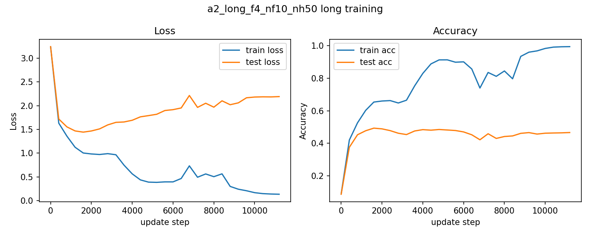
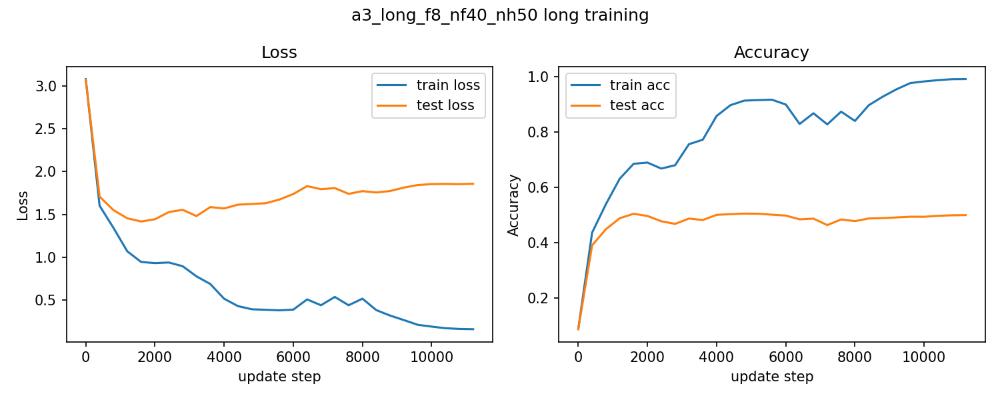
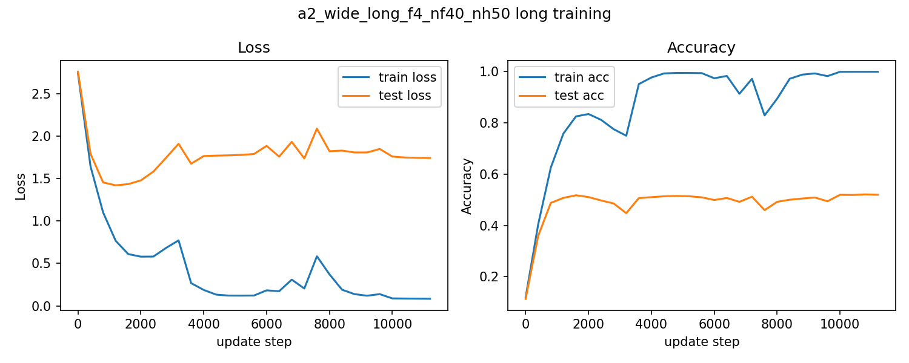
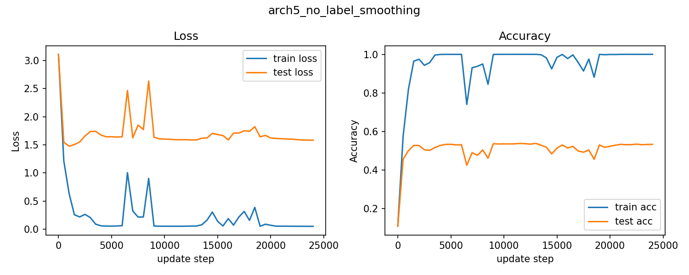
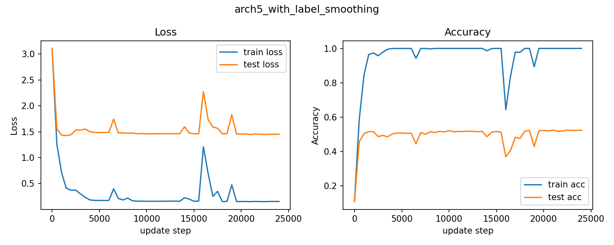

# DD2424: Deep Learning in Data Science

## **Assignment 3:** Three-Layer ConvNet with Patchify First Layer (CIFAR-10)

---

### **Submission Details**

| **Item**   | **Information**  |
| ---------- | ---------------- |
| **Date** | May 1, 2026 |
| **Course** | **DD2424** |
| **Task** | **Assignment 3** |

### **Student Information**

| **Field**       | **Details**                           |
| --------------- | ------------------------------------- |
| **Name**        | Jinye Gong                            |
| **Email**       | `jinyeg@kth.se`                       |
| **Affiliation** | **KTH Royal Institute of Technology** |

### **AI usage statement**

AI was used to assist with report formatting and code debugging. Implementation, experiments, and results are my own.

---

## 1. Objective

The objective of Assignment 3 is to implement and train a three-layer classifier on CIFAR-10 with an initial **patchify convolutional layer**:

- first layer: convolution with stride equal to filter width (`stride=f`, no overlap),
- then `ReLU`, flatten, fully connected `ReLU`, fully connected softmax classifier.

The optimization objective is:

- cross-entropy loss over mini-batches,
- plus L2 regularization on convolution filters and fully connected weights.

The assignment also requires:

- efficient convolution and gradient implementation via matrix multiplication (`MX`) and `einsum`,
- cyclical learning rates (including increasing cycle length),
- regularization analysis with label smoothing.

---

## 2. Data and Preprocessing

Following the assignment specification:

- Exercise 3/4 split:
  - training: `data_batch_1`
  - validation: `data_batch_2` (kept for consistency, primary reporting uses test set as in provided code flow)
  - test: `test_batch`

Preprocessing:

- pixel values scaled to `[0, 1]`,
- mean/std computed from training split only,
- train/val/test normalized with the same statistics.

---

## 3. Implementation

Implemented in `assignment3/Assignment3.py`:

- patchify representation builder: `build_mx(...)`
- slow reference convolution: `conv_slow(...)`
- fast convolution (`einsum`): `conv_fast(...)`
- forward pass for full network: `forward_pass(...)`
- backward pass including conv filter gradients: `backward_pass(...)`
- cyclic LR and increasing-cycle LR schedules
- full training/evaluation loops for Exercise 3 and 4
- automatic plotting and JSON result export.

Network equations implemented:

- `H = ReLU(MX @ Fs_flat + b_conv)`
- `h = flatten(H)`
- `x1 = ReLU(W1 h + b1)`
- `s = W2 x1 + b2`
- `p = softmax(s)`

---

## 4. Gradient Check and Debug Validation (i)

To verify gradient correctness, I compared my forward/backward outputs against `debug_info.npz`:

- compared tensors: `MX`, `conv_outputs_mat`, `conv_flat`, `X1`, `P`
- compared gradients: `grad_Fs_flat`, `grad_W1`, `grad_b1`, `grad_W2`, `grad_b2`

Command:

```bash
python Assignment3.py --mode debug --debug-npz debug_info.npz
```

Maximum absolute differences:

- `max|MX - debug MX| = 0.0`
- `max|conv_fast - debug conv_outputs_mat| = 1.776e-15`
- `max|P - debug P| = 2.220e-16`
- `max|grad_Fs_flat - debug| = 1.943e-16`
- `max|grad_W1 - debug| = 1.943e-16`
- `max|grad_W2 - debug| = 2.776e-16`

These errors are at numerical precision level, indicating the analytic gradients are bug-free.

Training time for the initial network in Exercise 3 (`f=4, nf=10, nh=50`, short run):

- **43.07 s**

---

## 5. Exercise 3: Short Runs with Varying `f` and `nf` (ii)

Settings:

- `n_cycles=3`, `step=800`, `eta_min=1e-5`, `eta_max=1e-1`, `n_batch=100`, `lam=0.003`

Final results:

| Model | `f` | `nf` | `nh` | Final test accuracy | Train time (s) |
|---|---:|---:|---:|---:|---:|
| `a1_f2_nf3_nh50` | 2 | 3 | 50 | 44.09% | 48.03 |
| `a2_f4_nf10_nh50` | 4 | 10 | 50 | 48.71% | 43.07 |
| `a3_f8_nf40_nh50` | 8 | 40 | 50 | 51.92% | 46.60 |
| `a4_f16_nf160_nh50` | 16 | 160 | 50 | 49.25% | 63.32 |

Required bar charts:




Brief comment:

- `f=8, nf=40` gave the best short-run accuracy in this set.
- `f=16, nf=160` increased training time noticeably without best accuracy.

---

## 6. Exercise 3: Longer Training with Increasing Cycle Length (iii)

I used the increasing-cycle variant (`step_{i+1}=2*step_i`) with `step_1=800`, `n_cycles=3`:

| Model | Final test accuracy | Train time (s) |
|---|---:|---:|
| `a2_long_f4_nf10_nh50` | 46.59% | 95.04 |
| `a3_long_f8_nf40_nh50` | 49.94% | 104.13 |
| `a2_wide_long_f4_nf40_nh50` | 51.97% | 123.44 |

Required loss/accuracy curves:





Brief comment:

- Increasing width for `f=4` from `nf=10` to `nf=40` improved final test accuracy (`46.59% -> 51.97%`), supporting the “wider helps” trend.

---

## 7. Exercise 4: Larger Network + Label Smoothing (iv)

Architecture 5:

- `f=4, nf=40, nh=300`
- increasing-cycle training, `n_cycles=4`, `step_1=800`

Compared setups:

| Setup | `lam` | `eps` | Final test accuracy | Final test loss | Train time (s) |
|---|---:|---:|---:|---:|---:|
| no label smoothing | 0.0025 | 0.0 | 53.30% | 1.5828 | 325.51 |
| with label smoothing | 0.0015 | 0.1 | 52.32% | 1.4515 | 235.38 |

Required curves:




Qualitative comment:

- Label smoothing produced a lower final test loss and generally smoother behavior,
- but in this run, the no-label-smoothing setup had slightly higher final test accuracy.
- This suggests a regularization trade-off and motivates finer joint tuning of `lam` and `eps`.

---

## 8. Next Experiments for Better Accuracy (v)

If more compute is available, the next experiments I would prioritize are:

1. **Systematic width scaling**
   - Keep `f=4`, test `nf` in `{40, 64, 96}` and `nh` in `{300, 500, 700}`.
   - Current results already indicate widening gives good gains.

2. **Joint regularization tuning**
   - Grid search `lam` and label smoothing `eps` together.
   - Track both test accuracy and test loss to avoid overfitting to a single metric.

3. **Longer training with LR schedule refinement**
   - Keep increasing-cycle length, but decay `eta_max` between cycles.
   - Aim for better late-stage convergence.

4. **Data augmentation**
   - Add random horizontal flip and random crop with padding.
   - Typically a high “accuracy per compute” improvement on CIFAR-10.

5. **Multi-seed reporting**
   - Repeat key configurations with multiple seeds for robust conclusions.

---
