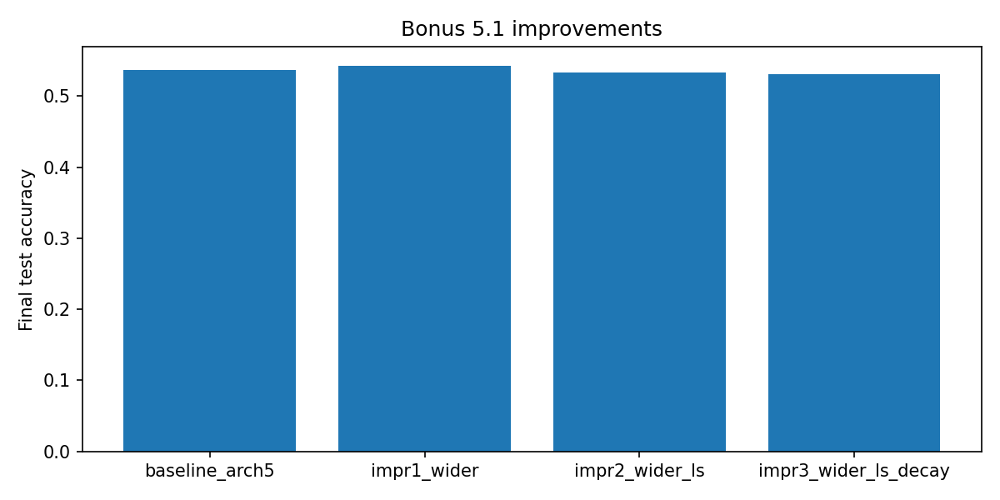
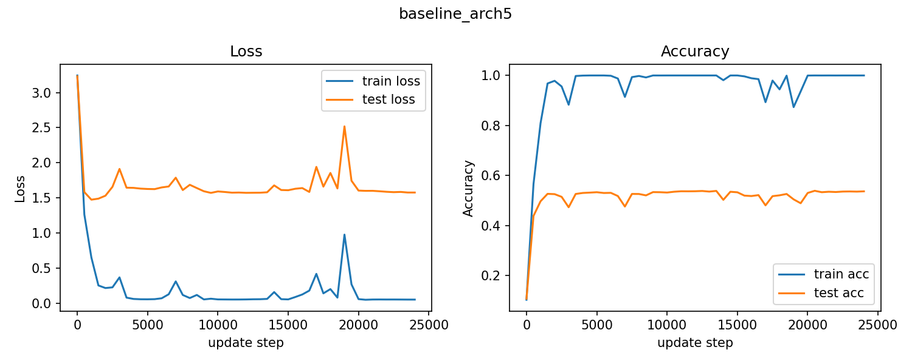
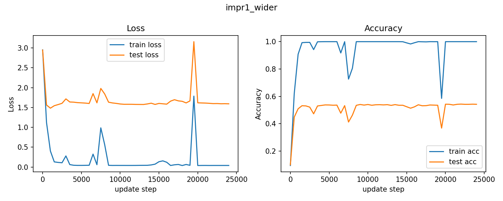
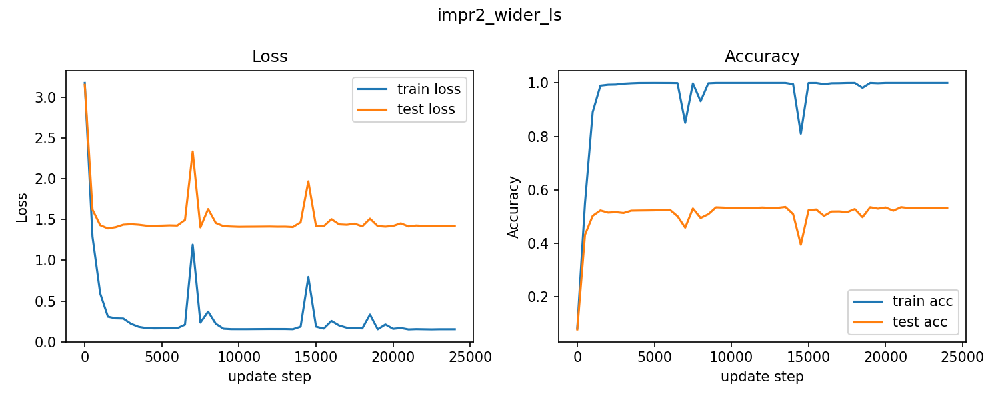
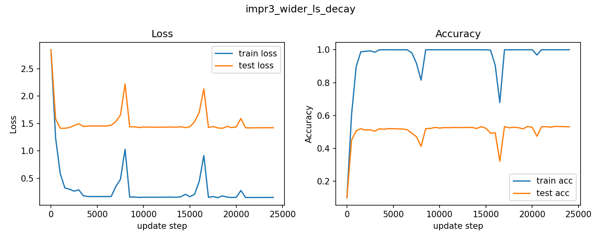
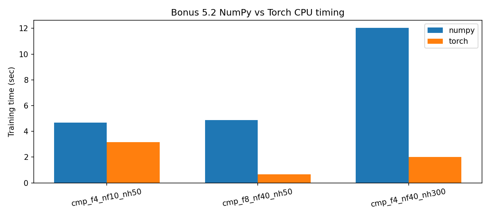

# DD2424: Deep Learning in Data Science

## **Assignment 3 Bonus Report**

---

### **Submission Details**

| **Item**   | **Information**  |
| ---------- | ---------------- |
| **Date** | May 5, 2026 |
| **Course** | **DD2424** |
| **Task** | **Assignment 3 Bonus (Exercise 5.1 + 5.2)** |

### **Student Information**

| **Field**       | **Details**                           |
| --------------- | ------------------------------------- |
| **Name**        | Jinye Gong                            |
| **Email**       | `jinyeg@kth.se`                       |
| **Affiliation** | **KTH Royal Institute of Technology** |

### **AI usage statement**

AI was used to assist with report formatting and code debugging. Implementation, experiments, and results are my own.

---

## 1. Bonus Objective

This bonus report covers:

- **Exercise 5.1:** push performance of the Assignment 3 network with multiple improvements.
- **Exercise 5.2:** compare CPU training speed of my NumPy implementation vs PyTorch (`torch.nn.functional.conv2d` based training path).

All outputs are generated in:

- `assignment3/results_assignment3_bonus/`

---

## 2. Exercise 5.1: Pushing Performance

### 2.1 Experiment setup

Starting baseline architecture:

- `f=4, nf=40, nh=300`

Improvements tested (at least 3):

1. **Increase width** (`nf`, `nh`)  
2. **Add label smoothing** (`eps=0.1`) with adjusted `lam`  
3. **Decay `eta_max` per cycle** (`eta_max_decay=0.9`) with increasing-cycle CLR

### 2.2 Results

| Run | `f` | `nf` | `nh` | `lam` | `eps` | `eta_max_decay` | Final test acc | Final test loss | Train time (s) |
|---|---:|---:|---:|---:|---:|---:|---:|---:|---:|
| baseline_arch5 | 4 | 40 | 300 | 0.0025 | 0.0 | 1.0 | 53.68% | 1.5760 | 388.68 |
| impr1_wider | 4 | 64 | 500 | 0.0020 | 0.0 | 1.0 | **54.24%** | 1.5933 | 584.26 |
| impr2_wider_ls | 4 | 64 | 500 | 0.0015 | 0.1 | 1.0 | 53.28% | **1.4208** | 394.16 |
| impr3_wider_ls_decay | 4 | 64 | 500 | 0.0015 | 0.1 | 0.9 | 53.09% | 1.4228 | 696.75 |

Best model in this bonus run:

- **`impr1_wider`**
- Final test accuracy: **54.24%**

### 2.3 Discussion

- Widening the network provided the largest gain in final test accuracy in this set.
- Label smoothing improved loss significantly but did not improve accuracy in this run.
- Decaying `eta_max` did not help accuracy here and increased training time.

### 2.4 Figures

---

## 3. Exercise 5.2: NumPy vs PyTorch CPU Speed

### 3.1 Setup

I compared training time between:

- my NumPy implementation (matrix patchify + `einsum` backprop),
- a PyTorch CPU implementation using `Conv2d` and autograd.

Three architectures were benchmarked.

### 3.2 Timing and accuracy results

| Architecture | NumPy time (s) | NumPy acc | Torch time (s) | Torch acc | NumPy / Torch time |
|---|---:|---:|---:|---:|---:|
| `cmp_f4_nf10_nh50` | 4.668 | 46.67% | 3.176 | 44.37% | 1.47x |
| `cmp_f8_nf40_nh50` | 4.866 | 47.50% | 0.669 | 46.43% | 7.27x |
| `cmp_f4_nf40_nh300` | 12.024 | 51.28% | 2.000 | 50.54% | 6.01x |

### 3.3 Conclusions

- In this environment, PyTorch CPU is faster on all tested configurations.
- The speed gap becomes much larger for wider/heavier models.
- Accuracy is comparable between implementations under matched training budgets.

### 3.4 Figure

---

