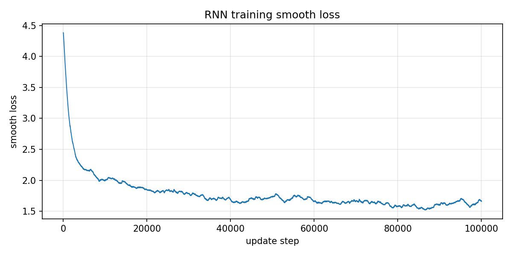

# DD2424: Deep Learning in Data Science

## **Assignment 4:** Vanilla RNN for Character-Level Text Synthesis (The Goblet of Fire)

---

### **Submission Details**

| **Item**   | **Information**  |
| ---------- | ---------------- |
| **Date** | May 15, 2026 |
| **Course** | **DD2424** |
| **Task** | **Assignment 4** |

### **Student Information**

| **Field**       | **Details**                           |
| --------------- | ------------------------------------- |
| **Name**        | Jinye Gong                            |
| **Email**       | `jinyeg@kth.se`                       |
| **Affiliation** | **KTH Royal Institute of Technology** |

### **AI usage statement**

AI was used to assist with report formatting and code debugging. Implementation, experiments, and results are my own.

---

## 1. Objective

The objective of Assignment 4 is to implement and train a **vanilla RNN** to synthesize English text **character by character**, using the full text of *Harry Potter and the Goblet of Fire*.

The network follows the equations from Lecture 9 (with bias terms):

```
a_t = W * h_{t-1} + U * x_t + b
h_t = tanh(a_t)
o_t = V * h_t + c
p_t = SoftMax(o_t)
```

The training objective is the **mean cross-entropy loss** over a sequence of length tau:

```
L = -(1/tau) * sum_t  y_t^T * log(p_t)
```

The assignment requires:

- data preparation and character indexing,
- forward and backward passes (BPTT) implemented in NumPy,
- optimization with **Adam**,
- text synthesis by sampling from the output distribution,
- gradient verification against PyTorch autograd.

---

## 2. Data and Preprocessing

Following the assignment specification:

- training text: `goblet_book.txt` (full novel text)
- total characters: **1,107,542**
- unique characters: **K = 80**

Preprocessing steps:

1. Read the book into a single string `book_data`.
2. Build `unique_chars = list(set(book_data))` as in the assignment handout.
3. Create two dictionaries:
   - `char_to_ind`: character → `unique_chars.index(ch)`
   - `ind_to_char`: index → character in `unique_chars`
4. Convert character sequences to one-hot matrices **X** and **Y** with shape **K × tau**, where the label at time **t** is the **next** character in the book.

Training sequences are extracted sequentially with pointer `e`, advancing by `seq_length` after each update. When `e` exceeds `len(book) - seq_length - 1`, `e` resets to 0 (one epoch completed).

---

## 3. Implementation

Implemented in `assignment4/Assignment4.py`:

- `read_book_data(...)`, `build_char_mappings(...)`
- `init_rnn(...)` with assignment default initialization
- `synthesize(...)` using equations (1–4) and cumulative-probability sampling
- `forward_pass(...)` and `backward_pass(...)` (BPTT)
- `adam_update(...)` with beta1 = 0.9, beta2 = 0.999, epsilon = 1e-8
- `gradient_check(...)` against `torch_gradient_computations_column_wise.py`
- training loop with smoothed loss logging and periodic synthesis,
- checkpoint export: `save_rnn_checkpoint(...)` stores the same `unique_chars` used in training (`rnn_params.npz` + `char_vocab.txt`) so inference always uses the training vocabulary.

PyTorch gradient skeleton completed in:

- `torch_gradient_computations_column_wise.py` (column storage, used for checking)
- `torch_gradient_computations_row_wise.py` (row storage variant)

### Hyper-parameters (assignment defaults)

| Parameter | Value |
|---|---:|
| hidden size m | 100 |
| learning rate eta | 0.001 |
| sequence length seq_length | 25 |
| optimizer | Adam |
| training updates (report run) | 100,000 |

### Training loop details

- `hprev` is zero when e = 0; otherwise it is the last hidden state from the previous update.
- Smoothed loss: `smooth_loss = 0.999 * smooth_loss + 0.001 * loss`
- Print `smooth_loss` every 100 updates.
- Synthesize 200 characters every 1,000 updates (for monitoring).
- Save 200-character samples **before training** (iter = 0) and **before updates** 10,000, 20,000, … (for the report).
- At epoch reset (e = 0), `hprev` is reset to zero.

One epoch corresponds to approximately **44,301** update steps. The 100,000-step run therefore covers **about 2.26 epochs**.

**Training command:**

```bash
conda run -n dd2424 python Assignment4.py --mode train --max-updates 100000
```

Training wall time (100k updates, CPU): **about 150 s**.

---

## 4. Gradient Check and Debug Validation (i)

To verify gradient correctness, I compared analytic BPTT gradients with PyTorch autograd on the first seq_length = 25 characters of the book, using a smaller network with m = 10.

**Gradient-check command:**

```bash
conda run -n dd2424 python Assignment4.py --mode gradcheck
```

Settings:

- input: `book_data[0:25]`
- labels: `book_data[1:26]`
- h0 = 0
- comparison module: `torch_gradient_computations_column_wise.ComputeGradsWithTorch`

Maximum relative errors:

| Parameter | Max relative error |
|---|---:|
| b | 2.101e-16 |
| c | 2.152e-16 |
| U | 2.172e-15 |
| W | 1.460e-14 |
| V | 7.205e-14 |

These errors are at numerical precision level, indicating that the analytic gradients are consistent with PyTorch autograd for this test case.

---

## 5. Training: Smoothed Loss Curve (ii)

The figure below shows the smoothed loss over 100,000 update steps (more than 2 epochs).



Observed trend:

- **iter = 0 (before training):** smooth_loss about 4.38 (near -log(1/K) for random initialization)
- **iter = 10,000:** smooth_loss about 2.00
- **iter = 30,000:** smooth_loss about 1.79
- **iter = 100,000 (before update):** smooth_loss about 1.66

The loss drops quickly at the beginning, then decreases more slowly, matching the behavior described in the assignment handout. The reference smoothed loss around epoch 3 in the instructions is about **1.55**; my final value is about **1.66**, which is in a similar range but slightly higher and reasonable given only about **2.26 epochs** in this run.

---

## 6. Evolution of Synthesized Text During Training (iii)

Below are 200-character samples generated **before training** (iter = 0) and **before updates** 10,000, 20,000, … (assignment requirement). For iter > 0, synthesis uses `hprev` at the start of that update step and the first input character of the current window. For iter = 0, synthesis uses h0 = 0 and bootstrap input `.`.

At iter = 0 the weights are still random, so the sample is unstructured character noise (expected before training).

### iter = 0 (before training), smooth_loss = 4.382

```text
Z;nJ)2dMHQT9RGmic•A!9t}x""oüF AxkiI-	Y_pw	Nm	VfrAWjBDU}X_jLj(1zh!•HTWUü(VKgOü•nZW/3/TuZrdtNNE
xVü	MH4!H-T9p}NUuh4yK2ürWlTH9730-kefMCeP3T} H7;""_s_S3NyxXBQh/(YZzH3XD9OPRkSsS1UAE-CZ(AE0}RytVfdd!:2aJfyYI
```

### iter = 10,000 (before update), smooth_loss = 1.999

```text
the ond in every bo tcemvered were.  Diddsers, aw likes.
"All, brewh ta thit ham stille- if oneWh are to and cooklos, rilly.
"Bow Ran, hearing ranfilaos "I shing tha D aby collo te fien ro larms hoor-
```

### iter = 20,000 (before update), smooth_loss = 1.848

```text
Hhthee cempically," said, bat her he wish," se wealed it regring it frrused bot cutkle conee ffacen tange, looking totrrit,"
"Charmitack of Harry.  "I whaten be tees right - VFreck of hakn that bele s
```

### iter = 30,000 (before update), smooth_loss = 1.788

```text
water. Harry sodes on wheres, water.  "I was, and say ant balk mo shoust ontos.  Bur!" . . ne miris mere the what his laker, wene pluttentle ow seear one of mart at long the cromentizes the likner?"
H
```

### iter = 40,000 (before update), smooth_loss = 1.689

```text
o did as salkeand the doite leppended now the Deads whithwa . Cedrraghed gring, them mone Voldoe I hears ruturn it Vored the time sfeive-lysh ground they wat bungerencied the cruach the eving herw a p
```

### iter = 50,000 (before update), smooth_loss = 1.735

```text
to he'd they weve onge intemamber could gome inse.  They was not poslyed onve spenting thry darwiagman endely fite turts of flack athey gctuld we knetten of ret one gavted roughals the told the pach t
```

### iter = 60,000 (before update), smooth_loss = 1.661

```text
se nests.  "We rut Harry is labb and sek?" saw all off.  Though," said, Pooflet, bit car.  "Year ussary Gryfarts asked soud down bagn, eey, asked she see impeted at hand," said Harry spet everyone's, 
```

### iter = 70,000 (before update), smooth_loss = 1.668

```text
o have cloak ufflember them one on heard her being me on the hisle, and Ron.  Ind Say you been his hapk going this forttaned," sauce is it's flapteriuse ganded a  untelinglasaring and foune besh now s
```

### iter = 80,000 (before update), smooth_loss = 1.584

```text
he spiriug.  It was bream," Howrigned into the Ditch Eates, though quilown a outser?"
"Ye with was movights at to the best and comperound, all. Harry sooking and shorwaf Harry was younde, a bul and an
```

### iter = 90,000 (before update), smooth_loss = 1.607

```text
t was ear ap hament?  He - a not in the clumped the mudned staidly anto hat voice, .... warcuses of May- Bottinfead, and with his same in him; the himsewore, smort s; you mame tey, forgiantly through 
```

### iter = 100,000 (before update), smooth_loss = 1.661

```text
ut a glions wordent as cleatermole, his ontite forair.
 "I'd with had behood over the beying on and He floodwalpes from thomsemuse or murtlish, and "The deple.  Howe rengets and open't daywe know who 
```

Brief comment:

- Early samples are random character noise.
- By 10k–20k steps, word-like fragments and punctuation appear.
- By 40k–80k steps, names such as **Harry**, **Hagrid**, **Hermione**, **Voldemort**, and **Dumbledore** begin to appear (often misspelled).
- Text remains noisy and grammatically incorrect, which is expected for a small vanilla RNN trained for only about 2.3 epochs.

Full saved samples are in `results/synth_samples.txt`.

---

## 7. Final 1000-Character Synthesis (iv)

After training, I generated a **1000-character** passage from the selected trained checkpoint from the 100,000-update training run. Bootstrapping uses a period character `.` and zero initial hidden state. The passage is saved in `results/final_synthesis_1000.txt`.

The checkpoint `results/rnn_params.npz` also stores `unique_chars` and `results/char_vocab.txt` so that character indices stay consistent when loading the model for synthesis.

Excerpt (full text in result file):

```text
"
Yourn.  Eh, farose that was them neck Beadizin. "Ludder any nater." Dumbledore had now!" he they light's sooroft them yeir wald," said Fred, youmbever peement the lard thumbingerouse...
...
```

The sample contains dialogue-like structure and recognizable name fragments (e.g. **Dumbledore**, **Ron**, **Hermione**), but spelling and syntax are still far from fluent English.

---

## 8. Summary

| Item | Result |
|---|---|
| Dataset | goblet_book.txt, K = 80 characters |
| Gradient check | Passed; relative errors from 2.10e-16 (b) to 7.21e-14 (V) |
| Training steps | 100,000 updates (about 2.26 epochs) |
| Final smoothed loss | about 1.66 |
| Artifacts | results/smooth_loss.png, results/synth_samples.txt, results/final_synthesis_1000.txt, results/rnn_params.npz, results/char_vocab.txt |

The implementation follows the assignment outline: column-vector storage for X, h, and network parameters; BPTT gradients including bias terms; Adam updates; and periodic text synthesis during training.

---
