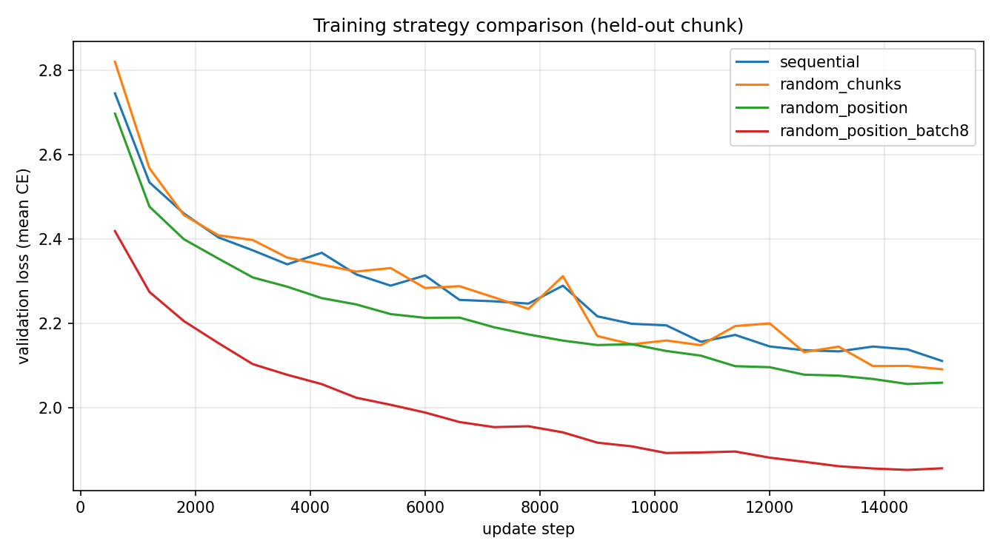
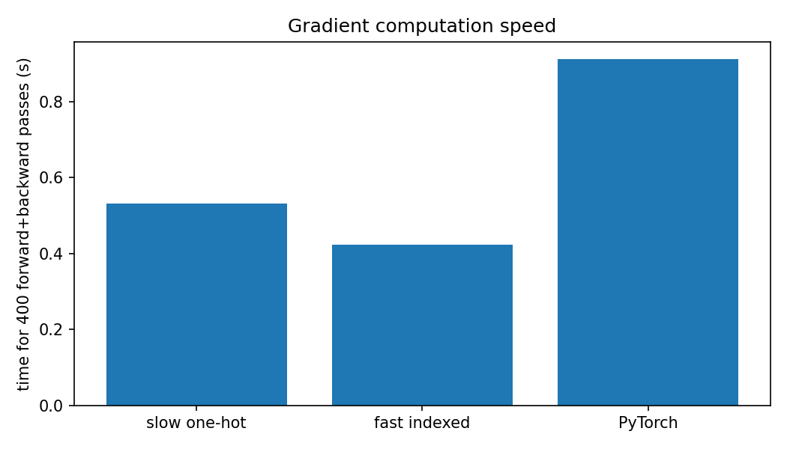

# DD2424: Deep Learning in Data Science

## **Assignment 4 Bonus Report**

---

### **Submission Details**

| **Item**   | **Information**  |
| ---------- | ---------------- |
| **Date** | May 15, 2026 |
| **Course** | **DD2424** |
| **Task** | **Assignment 4 Bonus (Exercise 2)** |

### **Student Information**

| **Field**       | **Details**                           |
| --------------- | ------------------------------------- |
| **Name**        | Jinye Gong                            |
| **Email**       | `jinyeg@kth.se`                       |
| **Affiliation** | **KTH Royal Institute of Technology** |

### **AI usage statement**

AI was used to assist with report formatting and code debugging. Implementation, experiments, and results are my own.

---

## 1. Bonus Objective

This bonus report covers four optional improvements from Assignment 4 Exercise 2:

1. **Alternative training order** with a held-out validation chunk (sequential vs random chunks vs random positions).
2. **Mini-batch training** (batch_size = 8) combined with random-position sampling.
3. **Temperature sampling** and **Nucleus sampling** for text generation.
4. **Faster gradient computation** using character indices, `np.outer` for W, and comparison to the baseline one-hot implementation and PyTorch autograd.

All code is in `assignment4/Assignment4_bonus.py`. Outputs are in `assignment4/results_bonus/`.

---

## 2. Setup

| Setting | Value |
|---|---|
| Text | goblet_book.txt (1,107,542 characters, K = 80) |
| Validation | 1 chunk of 20 (about 55,377 characters, chunk index 0) |
| Training data | remaining 19 chunks concatenated |
| RNN | m = 100, eta = 0.001, seq_length = 25, Adam |
| Comparison budget | 15,000 update steps per strategy |
| Init weights | same RNN copy for all strategies (init_rng = 100); per-strategy RNG only for sampling order |
| Base model for sampling | results/rnn_params.npz + results/char_vocab.txt from the 100k base training run |

**Bonus command:**

```bash
conda run -n dd2424 python Assignment4_bonus.py --mode all --max-updates 15000
```

---

## 3. Bonus 1: Training Order and Validation Chunk

### 3.1 Methods

| Mode | Description | hprev handling |
|---|---|---|
| sequential | Same as base assignment: scan text in order | Carry hprev within epoch; reset at epoch boundary |
| random_chunks | Shuffle all train chunks once per epoch, then visit each chunk sequentially | Reset hprev when starting a new chunk |
| random_position | Random start index each update | Reset hprev every update |

Validation loss: mean cross-entropy over non-overlapping seq_length windows on the held-out chunk (with h0 = 0 for each window).

### 3.2 Results (15,000 updates)

| Strategy | Final train smooth loss | Final validation loss |
|---|---:|---:|
| sequential | 1.912 | 2.111 |
| random_chunks | 1.903 | 2.092 |
| random_position | 2.011 | **2.060** |

### 3.3 Discussion

**Scope:** validation uses a **single held-out chunk** (about 1/20 of the book). Conclusions below are for **this run only**, not a guarantee across seeds or splits.

- In this run, **random-position** training reached the **lowest final validation loss** (2.060), despite a higher training smooth loss than sequential.
- **Random-chunk** was slightly better than sequential on validation in this run.
- Sequential had the lowest training smooth loss but not the lowest validation loss here.

### 3.4 Figure



---

## 4. Bonus 2: Mini-Batch Training

### 4.1 Method

- Mode: `random_position` with **batch_size = 8**
- Each update averages gradients from 8 independently sampled subsequences (each with hprev = 0).

**Fair comparison note:** batch-1 and batch-8 runs both use **15,000 optimizer updates**, but batch-8 consumes **8 times more character subsequences per update**. So batch-8 is **not** an equal-data comparison at equal update count.

### 4.2 Results

| Strategy | Final train smooth loss | Final validation loss |
|---|---:|---:|
| random_position (batch 1) | 2.011 | 2.060 |
| random_position_batch8 | **1.761** | **1.857** |

### 4.3 Discussion

In this run, mini-batch training improved both training smooth loss and validation loss versus batch-1 at the same 15,000 updates, but batch-8 also processed roughly 8 times more subsequences in total.

---

## 5. Bonus 3: Temperature and Nucleus Sampling

### 5.1 Method

Using the base-assignment model (`results/rnn_params.npz`), I load **unique_chars** from the checkpoint (or `char_vocab.txt`) via `load_rnn_checkpoint(...)` so that sampled indices match the training vocabulary.

Generated **250 characters** from x0 = `.` and h0 = 0, varying:

**Temperature** (softmax on o / T):

| Label | T |
|---|---:|
| low | 0.5 |
| medium | 1.0 |
| high | 1.5 |

**Nucleus sampling** (threshold theta on sorted probability mass):

| Label | theta |
|---|---:|
| low | 0.5 |
| medium | 0.9 |
| high | 0.99 |

### 5.2 Qualitative observations

| Setting | Observed behavior |
|---|---|
| low_T0.5 | Repetitive, conservative; many high-frequency fragments (the, to, and) |
| medium_T1.0 | Pseudo-English with dialogue; names such as Hermione, Harry, Ron |
| high_T1.5 | Higher diversity but more spelling noise |
| low_theta0.5 | Small high-probability subset only; repetitive |
| medium_theta0.9 | Better balance of diversity and structure |
| high_theta0.99 | Closer to full softmax; more irregular words |

**Temperature:** Low T produces conservative repetitive text. Medium T gives more varied pseudo-English and recognizable names. High T increases diversity but reduces coherence.

**Nucleus sampling:** Low theta keeps a small high-probability subset. Medium theta = 0.9 balances diversity and coherence. High theta = 0.99 is closer to full softmax sampling.

Full samples are in `results_bonus/bonus_sampling_samples.txt`.

### 5.3 Example excerpts

Each setting is shown with its sample immediately below.

#### medium_T1.0 (default-like; names and dialogue)

```text
 . So what withed hurs of Ard did nonstewing to sean.  Their priding back tcanesles and ilvery?"  said Hermione, and sevement whoiss you as exped, that was looks who the repore balloss alled a dumented...
```

#### medium_theta0.9 (nucleus; balanced)

```text
 "Harry, be moling into and the chortched out ener a large, now mores and flouden make got in the and have fasmed the have be are yeen dunges, who everyth enteaseen that that Hermione.  They's shrown you walked choments startions out...
```

#### low_T0.5 (repetitive)

```text
 . . ."
"They," said George you be the trees, who was several out of gat the tried a door as the carrick one of the ground the sill the dround the cauth it was was and a though he sat the the tears.  "Dumbledore, is in who head...
```

#### high_T1.5 (more diverse)

```text
  Wan!  FuentagS Ffan; he Hog's schoolf," was uftios.
"Thurures prampan. . ." said's in?"
"I 
Though two'cledled whather formanal, is definine your ichredermeking oyed frumpen knighted an thood wizar;?"
```

#### low_theta0.5 (conservative nucleus)

```text
  "You're got to see do your came one of the student the stumping of the stumping of the comenter of shouted to should on the down the dreation though of have a feel and the chooked of a door the fire of stund...
```

#### high_theta0.99 (near full distribution)

```text
"
"Ducmacly bet onet me not allight do devent of the Groffice were looked shogie.  Flether stop who's newill dedors's hime-"witherter," said Hermilacond to mioned shur one's narkit!  It warks telfn't jought and pherowing Manis...
```

---

## 6. Bonus 4: Faster Gradient Computation

### 6.1 Optimizations

Compared to the baseline one-hot multiply implementation:

1. **Indexed input:** use `U[:, x_t]` instead of full matrix multiply with one-hot columns.
2. **`np.outer`** for dW instead of `delta_a @ h_prev.T`.
3. Label gradient via character index instead of full one-hot subtraction.

### 6.2 Benchmark (400 forward+backward passes, m = 100, seq_length = 25)

| Implementation | Time (s) |
|---|---:|
| Slow (one-hot U @ x) | 0.532 |
| Fast (indexed + np.outer) | 0.424 |
| PyTorch autograd | 0.912 |

**Speed comparisons (this run):**

| Comparison | Result |
|---|---|
| Fast vs slow NumPy | about **1.25x faster** (0.532 / 0.424) |
| PyTorch vs slow NumPy | about **1.71x slower** (0.912 / 0.532) |
| PyTorch vs fast NumPy | about **2.15x slower** (0.912 / 0.424) |

On this CPU setup, the optimized NumPy path is faster than the naive one-hot implementation. PyTorch autograd on a single sequence of length 25 was slower here (Python overhead dominates).

### 6.3 Figure



---

## 7. Summary

| Bonus item | Main finding |
|---|---|
| 1. Training order | In this run, random-position / random-chunk had lower validation loss than sequential on one held-out chunk |
| 2. Mini-batches | Batch size 8 had lowest validation loss here (1.857), with 8x more subsequences per update than batch-1 |
| 3. Sampling | Lower T / theta gives more repetitive text; higher values give more diversity, less coherence |
| 4. Speed | Fast NumPy about 1.25x faster than slow; PyTorch about 1.71x slower than slow NumPy |

---

## 8. Files Submitted for Bonus

| File | Purpose |
|---|---|
| Assignment4_bonus.py | Bonus experiments |
| report_bonus.md | This report |
| results_bonus/bonus_results.json | Numeric results |
| results_bonus/bonus_val_loss_compare.png | Training-strategy plot |
| results_bonus/bonus_benchmark_timing.png | Timing bar chart |
| results_bonus/bonus_sampling_samples.txt | Temperature / nucleus samples |

---
